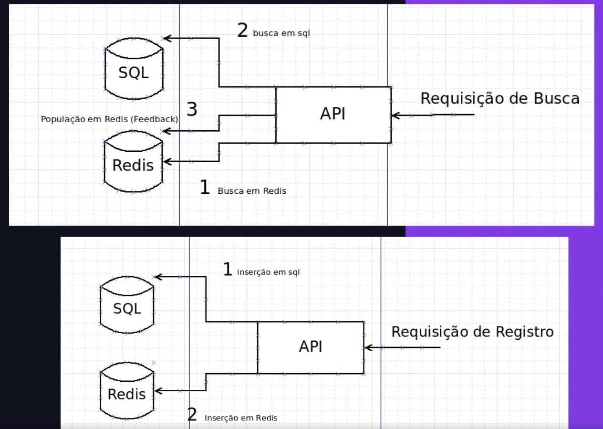

# eCommerce API



## Sobre o Repositório

Este repositório contém uma API RESTful para gerenciar produtos, com foco em otimizar consultas utilizando Redis para caching. O objetivo do projeto é explorar técnicas de cache para melhorar o desempenho nas consultas de dados dos produtos, reduzindo o tempo de resposta e o consumo de recursos no banco de dados.

## Funcionalidades

### 1. Registro de Produtos
Permite o cadastro de produtos no banco de dados SQL. Após o registro, o produto também é salvo no cache Redis, otimizando consultas futuras.

### 2. Busca de Produtos
A API permite a busca de produtos por ID. Caso o produto seja encontrado no cache (Redis), os dados são retornados diretamente, sem consultar o banco de dados, acelerando o tempo de resposta. Se o produto não estiver no cache, ele é recuperado do banco de dados SQL e, em seguida, salvo no cache para otimizar consultas futuras.

## Como Usar

1. Clone o repositório:
   ```bash
   git clone https://github.com/devGabyAlves/eCommerce-API-cache-optimization.git

2. Navegue até o diretório do projeto:
    ```bash
    cd eCommerce-API-cache-optimization

3. Instale as dependências do projeto:
    pip install -r requirements.txt

4. Inicie o Redis:
    redis-server

5. Execute a aplicação:
    python run.py

## Tecnologias Utilizadas

- Python: Linguagem principal utilizada para desenvolver a API.
- Flask: Framework para construção da API RESTful.
- Redis: Sistema de armazenamento em cache para otimizar as consultas ao banco de dados.
- SQLite: Banco de dados relacional utilizado para armazenar os produtos.

## Contribuição

Sinta-se à vontade para contribuir com melhorias ou novos exemplos de segurança para este repositório. Você pode abrir uma issue ou enviar um pull request.

## Licença

Este projeto está licenciado sob os termos da MIT License.